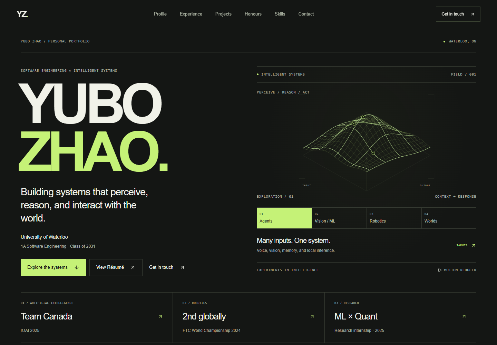

# Yubo Zhao — Personal Portfolio

An engineering portfolio showcasing work across software engineering, AI / machine learning, reinforcement learning, computer vision, robotics, and intelligent systems.

[Live Website](https://personal-website-one-pi-86.vercel.app) · [Architecture](#architecture) · [Run locally](#local-development) · [GitHub](https://github.com/YuboZhao2008) · [Résumé](https://personal-website-one-pi-86.vercel.app/resume.pdf)



## Overview

Yubo Zhao's personal portfolio brings together projects, engineering experience, competition achievements, and technical skills as a Software Engineering student at the University of Waterloo. A single-page layout pairs project descriptions and engineering notes with custom SVG and CSS visualizations.

Featured work includes Jarvis, the Warcraft III Reinforcement Learning Agent, Brain Tumor MRI Classification, Gesture-Controlled Drawing Interface, and Future-Sim. The Warcraft project focuses on the environment and control infrastructure for real-time RTS reinforcement learning; learned policies are still in development.

## Tech Stack

| Area                   | Technologies                                      |
| ---------------------- | ------------------------------------------------- |
| Framework              | Next.js 16 App Router, React 19                   |
| Language               | TypeScript with strict checking                   |
| Styling                | Tailwind CSS 4, authored CSS, Lucide icons        |
| Interaction and motion | React state, CSS animations, IntersectionObserver |
| Validation             | ESLint, TypeScript, Playwright Core, axe-core     |

## Highlights

- **Responsive layouts:** custom desktop and mobile compositions, with a native modal mobile navigation dialog that handles keyboard focus, Escape, and viewport changes.
- **Interactive technical illustrations:** a computational surface, multimodal architecture diagram, Warcraft observation–policy–action loop, gesture landmark selector, and deterministic world-state controls. These illustrate the featured work; they do not run its AI models or process camera input.
- **Motion controls:** support for `prefers-reduced-motion`, an ambient animation pause/resume control, and offscreen animation pausing.
- **Content available without JavaScript:** prerendered portfolio content and native HTML disclosures for project notes and additional skills.
- **Structured content:** centralized profile data and typed project records select their presentation and visualization, while shared components render experience, achievements, and skills.
- **Public evidence and résumé:** project links render only when configured with valid HTTPS destinations; the public résumé PDF is linked from the hero and contact section.
- **Search and sharing metadata:** a generated 1200 × 630 sharing image, plus canonical and sitemap URLs derived from an optional configured origin.

## Architecture

```text
src/
├── app/          Page composition, layout, global CSS, metadata routes
├── components/   Sections, navigation, project displays, interactive diagrams
├── data/         Typed portfolio content and site configuration
└── styles/       Styles for navigation, hero, projects, and other sections
scripts/
└── check-browser.mjs   Browser and accessibility validation
docs/
└── images/       Curated README screenshots
```

[`src/app/page.tsx`](src/app/page.tsx) composes the page from reusable sections. Server Components render the content, with Client Components handling navigation, diagram state, and motion. The home page, crawler metadata, and sharing image are prerendered during the production build.

## Local Development

Use **Node.js 24** and npm, matching the validated development runtime. From the cloned repository:

```sh
npm ci
npm run dev
```

Open [localhost:3000](http://localhost:3000). `npm ci` installs the versions recorded in the lockfile. On Windows, use `npm.cmd` if PowerShell blocks `npm.ps1`.

No environment variables or API credentials are required. For local metadata testing, copy [`.env.example`](.env.example) to `.env.local` and set the optional `SITE_URL`.

## Production Build

```sh
npm run build
npm start
```

The production server uses [localhost:3000](http://localhost:3000). Stop any development server using that port first.

## Validation

```sh
npm run typecheck
npm run lint
npm run build
```

Type-checking generates Next.js route declarations before running TypeScript, so it also works before the first development server or build.

With a development or production server running, use a second terminal for browser validation:

```sh
npm run test:browser
```

Use the same `SITE_URL` value as the tested build when running the suite so metadata assertions match that build.

The suite checks eleven viewport widths from 320 to 1920 pixels, horizontal overflow, keyboard and touch interactions, mobile focus isolation and restoration, disclosures, motion preferences, punctuation, optional links, diagram bounds and mobile label sizes, production metadata, browser errors, and content without JavaScript. Warcraft-specific checks cover its control-loop diagram, stacked layout, readable labels, and ambient motion. axe-core scans representative mobile, tablet, and desktop widths for WCAG A/AA rule violations.

| Browser test option | Default / usage                                                                                                           |
| ------------------- | ------------------------------------------------------------------------------------------------------------------------- |
| `BASE_URL`          | `http://127.0.0.1:3000`; override to test another local port or the deployed site                                         |
| `BROWSER_PATH`      | Standard Windows Chrome installation; set an absolute path to an installed Chrome or Chromium executable on other systems |

Playwright Core uses an existing browser and does not download one. Test screenshots and reports are written to ignored `test-results/`. The [README screenshot](docs/images/portfolio-homepage.png) was captured directly from the live production homepage at 1440 × 1000 with reduced motion and no browser chrome. To refresh it with the suite, set `BASE_URL` and `SITE_URL` to the live production origin, run `npm run test:browser`, review `test-results/hero-1440.png`, and copy it to `docs/images/portfolio-homepage.png`.

## Content Management

Edit [`src/data/profile.ts`](src/data/profile.ts) for profile information, education, projects, experience, achievements, skills, navigation links, and social destinations. Edit [`src/data/site.ts`](src/data/site.ts) for the site title, description, and origin handling.

Each project includes an ID, description, technologies, engineering notes, a `presentation` (`flagship`, `case-study`, or `secondary`), and a `visual` (`intelligence`, `warcraft`, `medical`, `gesture`, or `simulation`). Optional `evaluation` data includes measurement context. `originalTitle` preserves a formal or résumé project name when its display title is clarified.

When adding projects, review the section introduction in `src/components/content-sections.tsx`; the section counter and browser checks use the configured project count. Adding a new visualization also requires extending the `Project` type and `ProjectVisual` renderer. Substantial diagrams have standalone components, including `jarvis-visual.tsx` and `warcraft-visual.tsx`. Shared section copy lives in the components.

| Configuration in `src/data/profile.ts`                                               | Behavior                                                                                            |
| ------------------------------------------------------------------------------------ | --------------------------------------------------------------------------------------------------- |
| `profile.socials.resume`                                                             | HTTPS résumé URL or site-relative PDF path; enables **View Résumé** in the hero and contact section |
| `profile.socials.github`                                                             | Your verified GitHub profile URL; shown in contact                                                  |
| `profile.opportunity.targetRoles`                                                    | Concise areas of interest, shown subtly in contact                                                  |
| `profile.opportunity.status` / `availability`                                        | Optional confirmed opportunity status and availability text; no date is assumed                     |
| Project `repositoryUrl`, `demoUrl`, `caseStudyUrl`                                   | Optional evidence actions; only configured HTTPS destinations render                                |
| Achievement `verificationUrl`, `team`, `teamNumber`, `resultDetail`, `scope`, `year` | Optional verification and context; missing fields remain hidden                                     |

Keep unknown values `null` (or an empty `targetRoles` array). Evidence URLs are unset until the corresponding work is ready to share. The résumé is served from `public/resume.pdf` at `/resume.pdf`; replace that file to update it. Both résumé actions open in a new tab. Link handling is centralized in `src/data/links.ts`.

## Deployment

The site runs on Vercel with `main` as the production branch. Pushes to `main` trigger production deployments through [Vercel's Git integration](https://vercel.com/docs/git); branch changes use preview deployments. The project uses the repository root, Node.js 24.x, `npm ci`, `npm run build`, and the default [Next.js settings](https://vercel.com/docs/frameworks/full-stack/nextjs).

`SITE_URL` is configured in Vercel's Production environment as `https://personal-website-one-pi-86.vercel.app`. It supplies canonical, sitemap, and sharing-image URLs at build time. It remains optional locally: when unset, those absolute URLs are omitted while the site and `/share-image` still work. Keep it unset in Preview unless previews should use the production canonical origin.

A custom domain can be added later. When changing the primary domain, update production `SITE_URL`, the public website and résumé links in this README, and GitHub's **About → Website** field, then rebuild to apply the metadata change.
